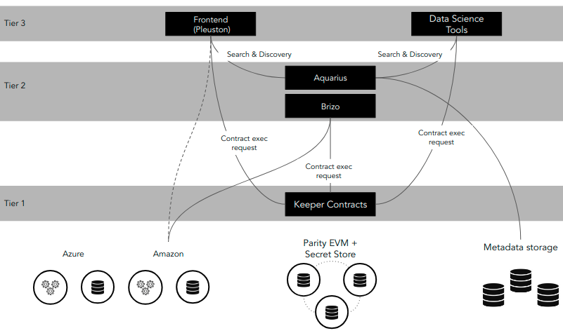

The Ocean Protocol network architecture is implemented based on [OEP-03/ARCH](https://github.com/oceanprotocol/OEPs/tree/master/3).

In the above diagram you can see the following components (from top to bottom):

- **Frontend** (Tier 3)
- **Data Science Tools** (Tier 3)
- **Aquarius** (Tier 2)
- **Brizo** (Tier 2)
- **Keeper Contracts** (Tier 1)

Below, we describe what those components do.

## Components

### Tier 3 - Application Layer

#### Frontend

A marketplace/publisher app, typically running in a web browser, implementing the following high-level functionality:

- **Publishing** - Allows the user to publish new assets to the network.
- **Consuming** - Allows the user to list and consume published assets.
- **Marketplace** - Enables complex interactions and advanced capabilities like:
  - Publishing of Assets existing in cloud providers
  - Search and discovery of assets
  - Filtering
  - User registration using specific KYC processes (to be added)

A frontend communicates with all the components in Tier 2 and Tier 1 (described later in this document).

The Squid library shown in the above diagram encapsulates the logic to deal with the Ocean components (such as Keeper nodes and Aquarius nodes). Squid libraries (written in various programming languages) are part of Tier 2.

There are several example frontends. They can be used as a starting point for developing a new one.

- Pleuston
- Commons Marketplace
- The app developed in [the React App Tutorial](https://docs.oceanprotocol.com/tutorials/react-setup/)

#### Data Science Tools

Data science Tools are the interface to Ocean used by data scientists. Typically written in Python (but not limited to it),
those tools and libraries expose a high-level API allowing one to integrate Ocean capabilities in various computation pipelines.

### Tier 2 - Protocol Layer

Includes all the high-level libraries to interact with Ocean Protocol, and the enabler components complementing the Keeper Contracts.

#### Squid Libraries

Squid is a High Level specification API abstracting the interaction with the most relevant Ocean Protocol components.
It allows one to use Ocean capabilities without worrying about the details of the underlying Keeper Contracts or Metadata storage systems.

The Squid API can be implemented in many different languages. It's currently implemented in [JavaScript](https://github.com/oceanprotocol/squid-js), [Python](https://github.com/oceanprotocol/squid-py) and [Java](https://github.com/oceanprotocol/squid-java).

The complete specification of [the Squid API can be found in the oceanprotocol/dev-ocean repository on GitHub](https://github.com/oceanprotocol/dev-ocean/blob/master/doc/architecture/squid.md).

#### Aquarius

Aquarius is a Python application running in the backend that enables Metadata management. It abstracts access to different Metadata stores, allowing Aquarius to integrate different Metadata repositories. The OceanDB plugin system can integrate different data stores (e.g. Elasticsearch, MongoDB, BigchainDB) implementing the OceanDB interfaces.

The high-level architecture of Aquarius is shown in the following diagram:

#### Brizo

Brizo is a component providing capabilities for Publishers.
It interacts with the Publisher's cloud and/or on-premise infrastructure.
The most basic scenario for a Publisher is to provide access to the Assets the Publisher owns or manages.
In addition to this, other extended services could also be offered, e.g.

- Computing on top of the data without moving the data
- Storage services for newly derived assets
- Gathering of Service Proofs - Enables different kinds of service proofs from different providers. For example - allowing the retrieval of receipts from cloud providers to validate service delivery.
- On-Chain Access Control - Brizo is in charge of the on-chain validation, controlling the assets or services that a consumer is entitled to get access to. This happens by integrating with the Keeper from the Brizo side.

### Tier 1 - Decentralized VM Layer

#### Keeper Contracts

The Keeper Contracts are Ocean-Protocol-specific smart contracts which can be deployed to run on any decentralized [Ethereum Virtual Machine (EVM)](https://github.com/ethereum/wiki/wiki/Ethereum-introduction#about-ethereum). You can find their source code in [the keeper-contracts repository](https://github.com/oceanprotocol/keeper-contracts).

## Interactions

See [OEP-11](https://github.com/oceanprotocol/OEPs/tree/master/11).
