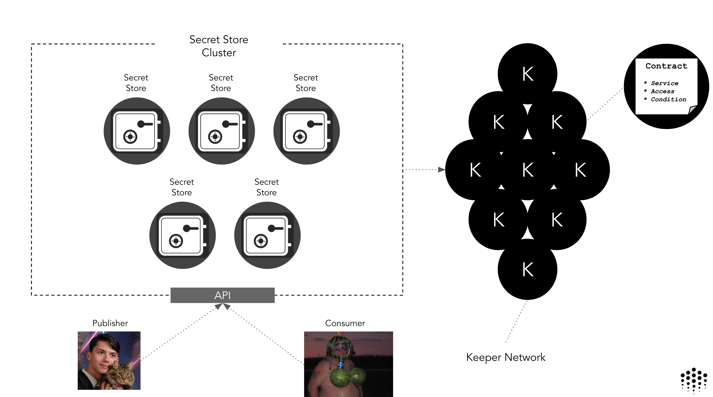

Table of Contents
=================

---

This page describes the Parity Secret Store integration.

# Introduction

Parity Secret Store is a feature included as part of the Parity Ethereum client that allows to store on the blockchain a fragmented ECDSA key which retrievals are controlled by a permissioned Smart Contract.
The Secret Store implements a Threshold System that makes nodes unable to reconstruct the keys that allows to decrypt the documents.
It means a Secret Store node, only saves a portion of the ECDSA key. The decryption key can only be generated if a consensus is reached by an amount of Secret Store nodes bigger than the threshold that the publisher of secret chooses.

From the [Parity Secret Store documentation](https://wiki.parity.io/Secret-Store) page:

The Parity Secret Store is core technology that enables:

* distributed elliptic curve (EC) key pair generation - key is generated by several parties using special cryptographic protocol, so that:
  - private key portion remains unknown to every single party;
  - public key portion could be computed on every party and could be safely exposed to external entities;
  - every party hold the ‘share’ of the private key;
  - any subset of t+1 parties could unite to restore the private portion of the key;
  - any subset of less than t+1 parties could not restore the private portion of the key;
* distributed key storage - private key shares are stored separately by every party and are never exposed neither to another parties, nor to external entities;
* threshold retrieval according to blockchain permissions - all operations that are requiring private key, require at least t+1 parties to agree on ‘Permissioning contract’ state.

This last point can enable to Ocean Protocol to have a solid mechanism to distribute encrypted contents between parties (Consumers and Publishers),
and these contents only can be decrypted after a On-Chain authorization phase.

# Architecture

The current implementation of Ocean Protocol, detailed in the [OEP-10](https://github.com/oceanprotocol/OEPs/tree/master/10) requires to involve to the Publisher, Consumer, Provider and Smart Contracts
to build an interaction flow. This integration was difficult, needs to scale to support delegation of permissions and because the complexity is a potential source of errors.

The integration of the Secret could have the following characteristics:

* All the negotiation required to encrypt or decrypt a resource is happening without write any information on-chain
* This integration only requires standard HTTP requests between the clients (Consumer, Publisher) and the Parity EVM & Parity Secret Store API's (no gas, quick)
* Requires the usage of the Parity EVM Secret Store API existing in the Parity Ethereum clients
* Requires the usage of the Parity Secret Store API. This software is part of the Parity Ethereum client
* It's based in the usage of a permissioned Secret Store cluster. This cluster would be deployed/governed by Ocean Protocol foundation at network launch as part of the base Ocean core capabilities. Additional parties (user/companies/organizations) could be added as members allowing to decentralzied the responsibility of running this infrastructure.

## Links

* [Parity Secret Store](https://wiki.parity.io/Secret-Store)
* [ECDKG: A Distributed Key Generation Protocol Based on Elliptic Curve Discrete Logarithm](http://citeseerx.ist.psu.edu/viewdoc/summary?doi=10.1.1.124.4128&rank=1)
