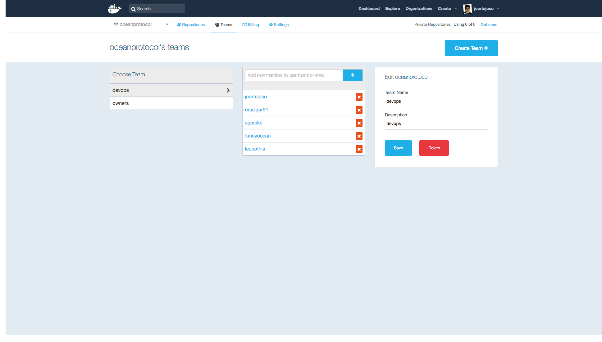

# Docker images generated with CI

Table of Contents
=================

   * [Dockerhub](#dockerhub)
      * [Dockerhub vs. Docker Cloud](#dockercloud)
      * [When and what images are built](#images)
      * [Dockerhub setup](#dockerhub-setup)
         * [Creating/Configuring a new Automated Image](#new-image)
         * [Collaborators &amp; teams](#collaborators-teams)

[Dockerhub](https://hub.docker.com/) is the default Docker image repository managed and maintained by Docker Inc. In addition to the repository features, it also offers the possibility of automate the building of the Docker images using Github or Bitbucket triggers.

Ocean images can be found in [Ocean Protocol organization](https://hub.docker.com/u/oceanprotocol/) page in Dockerhub.

## Dockerhub vs. Docker Cloud

[Dockercloud](https://cloud.docker.com) is a Docker Inc. service built on top of Dockerhub. It adds some testing and CI facilities over Dockerhub, but it also adds some limitations to Dockerhub possibilities.

Some of the additions of Docker Cloud over Dockerhub are:
   * Possibility of running CI tests when a new image is built.
   * The building and testing process can be added to Github checks.
   * Possibility of configuring the location of Dockerfile and using building environment variables.

There are also some other downsides when comparing with Dockerhub:
   * Docker Cloud does not allow to build an image when pushing any branch. Rules can be created to building an image when pushing a specific branch.
   * Building process lasts quite a long when using free infrastructure, which can lead to block the CI process.
   * We found that the building trigger does not work all the times.

Having in consideration these issues we decided to keep using Docker hub for now.

## When and what images are built

Dockerhub current setup will build images when:
   * A new commit is committed in master. This will create a new version in `<image>:stable` tag.
   * A new commit is committed in develop. This will create a new version in `<image>:latest` tag.
   * A new commit is committed in any other branch. This will create a new version in `<image>:<branch_name>` tag.
   * A new tag is pushed. This will create a new version in `<image>:<tag>` tag.

Dockerhub builds the image from a _Dockerfile_ located in the root of the repository.

## Dockerhub Setup

### Creating or configuring a new Automated Image
To add a new image it must be used the _Create Automated Build_ menu. Using Github as source and select the github repository used as source for building the image.

In order to have an homogeneous Dockerhub setup and Docker images, it is necessary to configure all the development projects using the following setup:

### Collaborators & teams
In order to allow a Dockerhub user to configure/add a image in Ocean organization, the user id must be added to the _devops_ or _owners_ team.

