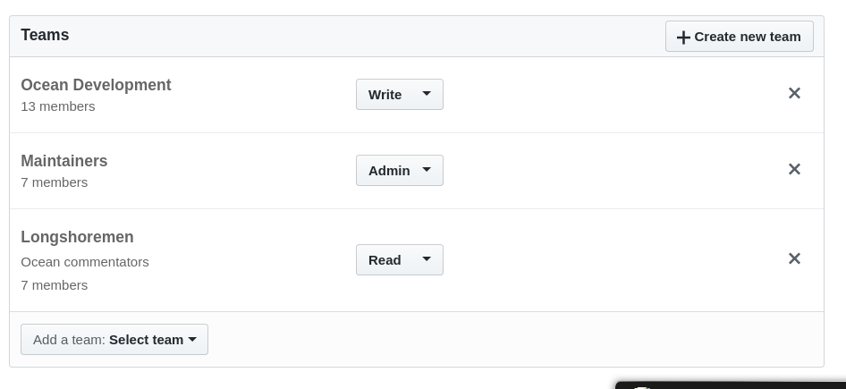
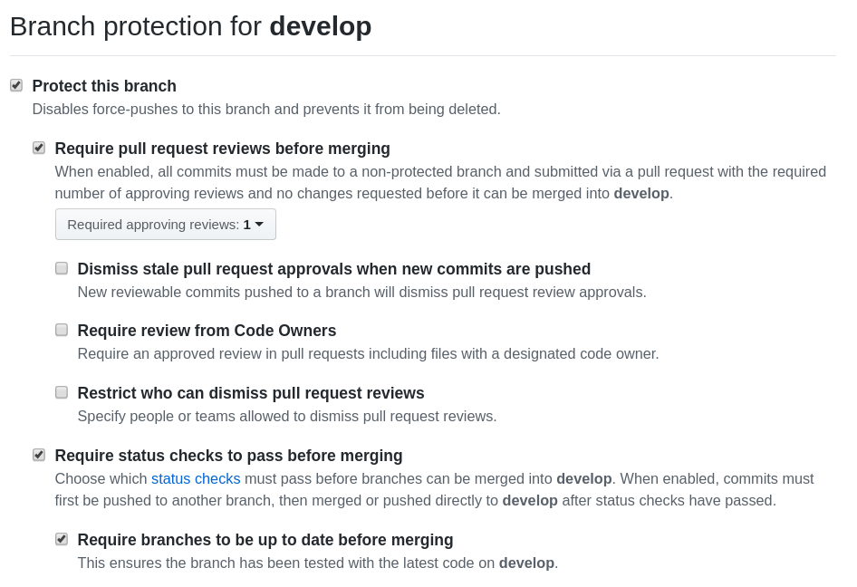

**Table of Contents**

<!--ts-->
   * [GitHub Default Configuration](#github-default-configuration)
      * [Collaborators &amp; Teams](#collaborators--teams)
      * [CODEOWNERS](#codeowners)
      * [Branches](#branches)
         * [Default Branch](#default-branch)
         * [Branch protection](#branch-protection)
      * [Visibility](#visibility)
      * [CONTRIBUTING.md and PR &amp; Issue Templates](#contributingmd-and-pr--issue-templates)

<!--te-->

---

# GitHub Default Configuration

In order to have a homogeneous GitHub setup, it is necessary to configure all the development projects using the following approach.

## Collaborators & Teams

All the development repositories just created should be configured adding the following teams:

* [Ocean Development](https://github.com/orgs/oceanprotocol/teams/ocean-development) team with **Write** grants
* [Maintainers](https://github.com/orgs/oceanprotocol/teams/maintainers) team with **Admin** grants
* [Longshoremen](https://github.com/orgs/oceanprotocol/teams/longshoremen) team with **Read** grants



The **Longshoremen** team is composed by Ocean commentators. They can have read visibility in Private repositories, enabling to get feedback before to make public a project.

Additional permissions can be required in different situations. For example, the [Token Backend](https://github.com/oceanprotocol/token-backend) project is being implemented by an external company (Fractal). So, in addition to the previous permissions, the Fractal development team is included in the [Fractal](https://github.com/orgs/oceanprotocol/teams/fractal) team with Write grants.

## CODEOWNERS

We use the [CODEOWNERS](https://help.github.com/articles/about-codeowners/) feature of GitHub.

> About CODEOWNERS
>
> You can use a CODEOWNERS file to define individuals or teams that are responsible for code in a repository.
>
> People with admin or owner permissions can set up a CODEOWNERS file in a repository. The people you choose as code owners must have write permissions for the repository.
>
> Code owners are automatically requested for review when someone opens a pull request that modifies code that they own. When someone with admin or owner permissions has enabled required reviews, they also can optionally require approval from a code owner before the author can merge a pull request in the repository.

The basic ocean CODEOWNERS file looks like this:

```
*       @oceanprotocol/maintainers @oceanprotocol/core-dev
```

## Branches

### Default Branch

The default branch is considered the “base” branch in your repository. Taking into account the [Gitflow branching model](../development/branching-model.md), the default branch we should show as entry point is **master**.
The **master** branch must includes the stable & released versions of the software.

### Branch protection

**Master & develop** branches must be protected. This should avoid direct pushes to those branches or deletions. In addition to this, the following setup should be applied:


* Pull requests (PR) are required before merging
* At least, one approved review is required to merge a pull request. Critical projects could require more approvals before merging.
* Require status checks to pass before merging

Some small projects could not require **develop** branch. In those cases, this configuration applies only to **master** branch.



## Visibility

The Github repositories just created must be configured as **Private**.
This configuration must be applied until an initial stable version be released and the project includes the [required Open Source configuration](https://github.com/oceanprotocol/art/tree/master/github).

## CONTRIBUTING.md and PR & Issue Templates

A `.github` folder should be added to the repo with the following files:

* a `CONTRIBUTING.md` file containing the text:

  ```text
  # Contributing

  See the page titled
  "[Ways to Contribute](https://docs.oceanprotocol.com/concepts/contributing/)"
  in the Ocean Protocol documentation.
  ```

* an `issue_template.md` file
* a `pull_request_template.md` file
